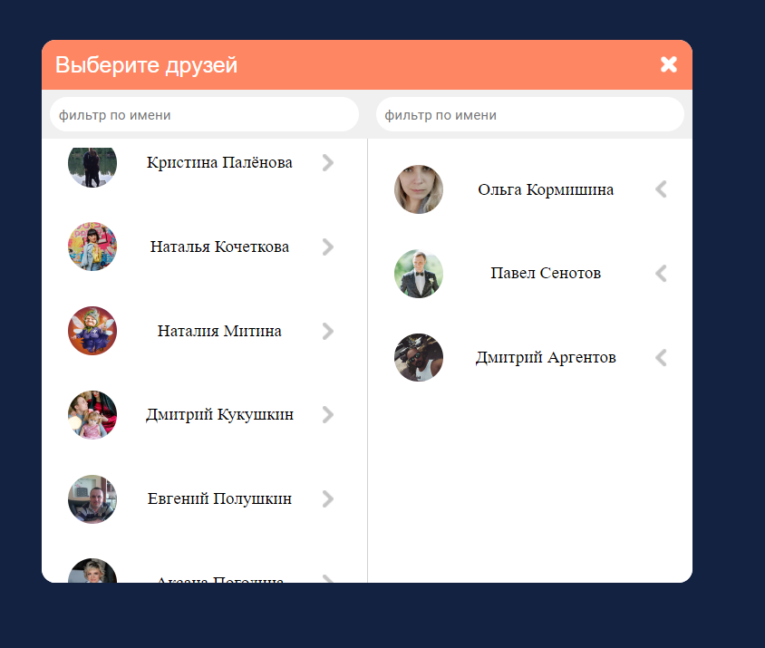
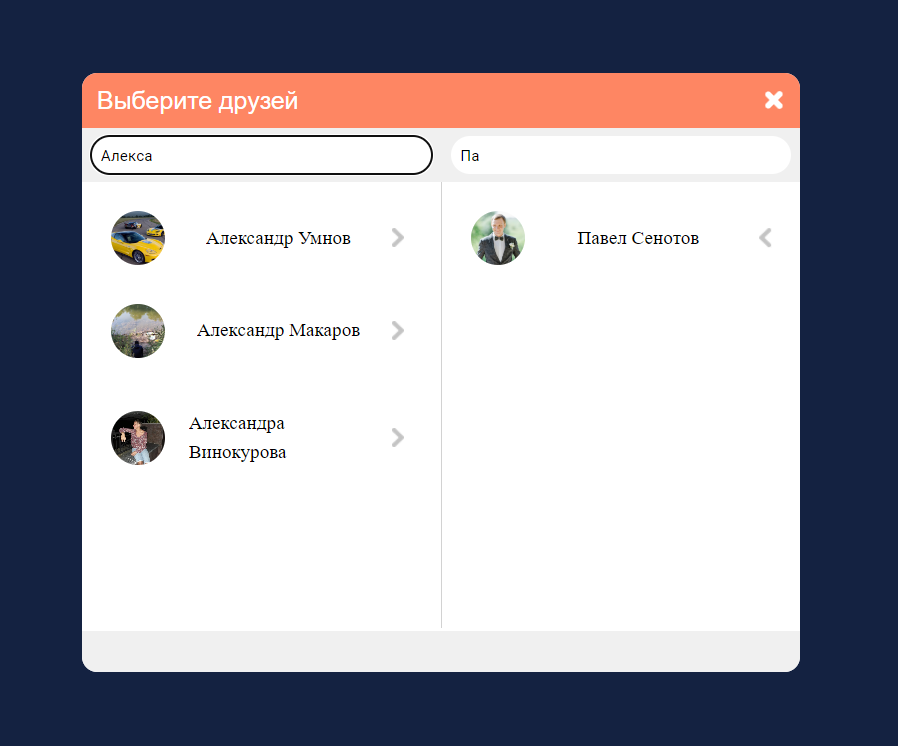
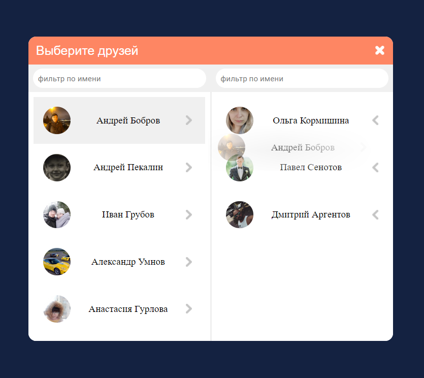
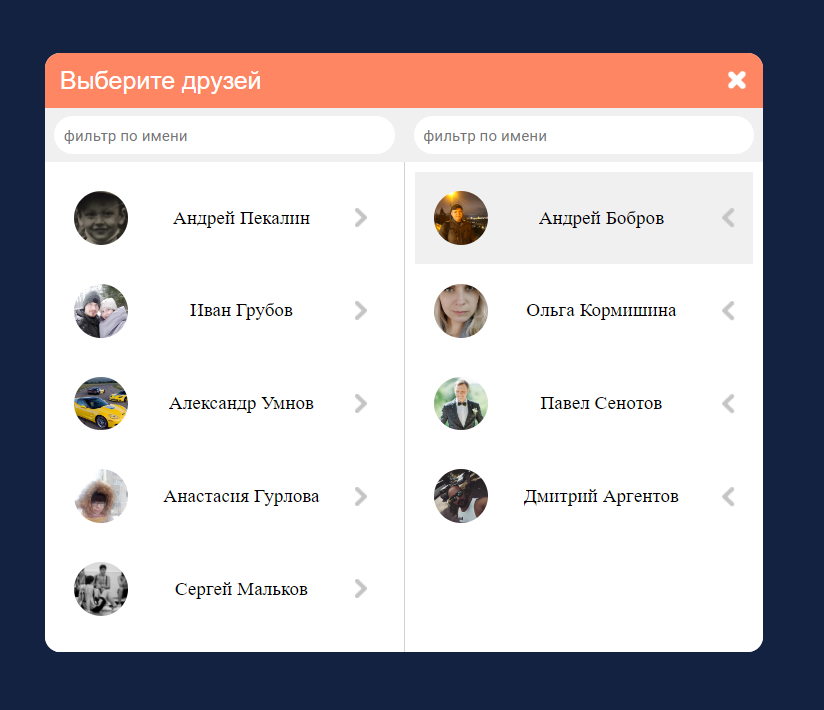

## FoldingFriends

#### Пример разработки приложения на VK API + fastify

### Как установить
- git clone https://github.com/sharp2point/FoldingFriends
- npm i
- npm run start
- перейти -> http://localhost:1234

### Скриншоты

